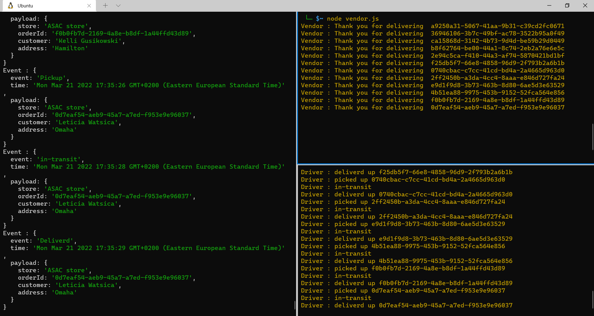
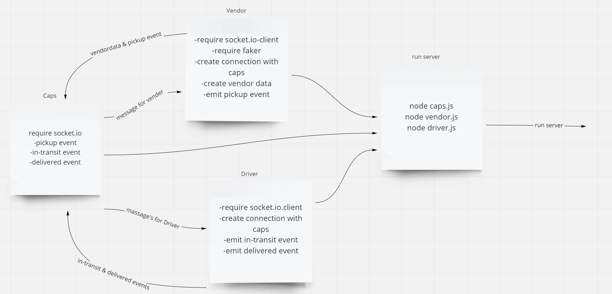

# caps.io

# Desicrption
We build of product called caps, CAPS will simulate a delivery service where vendors (such a flower shops) will ship products using our delivery service and when our drivers deliver them, each vendor will be notified that their customers received what they purchased

# UML

# Links

- [Action link](https://github.com/WalidAlrefai/caps.io/actions)
- [Pull request link](https://github.com/WalidAlrefai/caps.io/pull/1)
